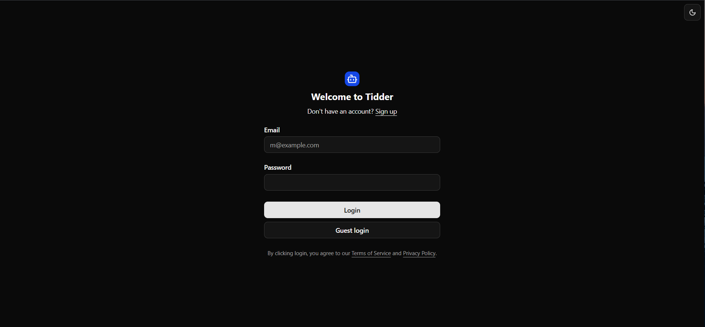
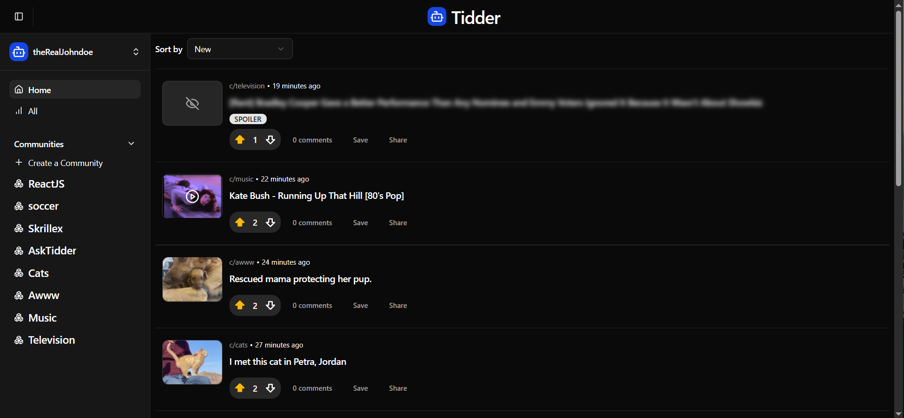
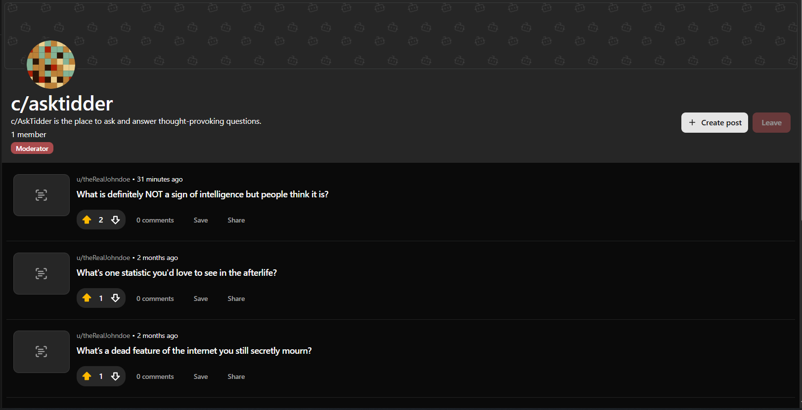
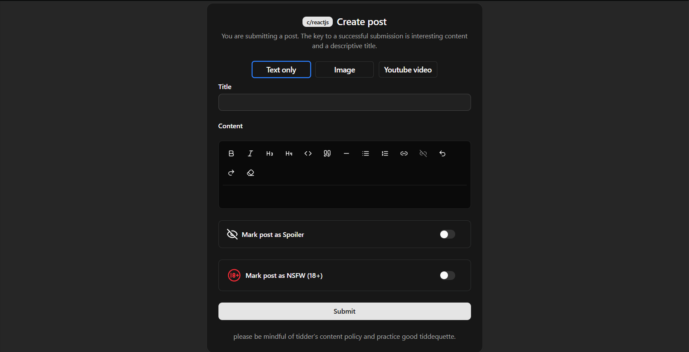
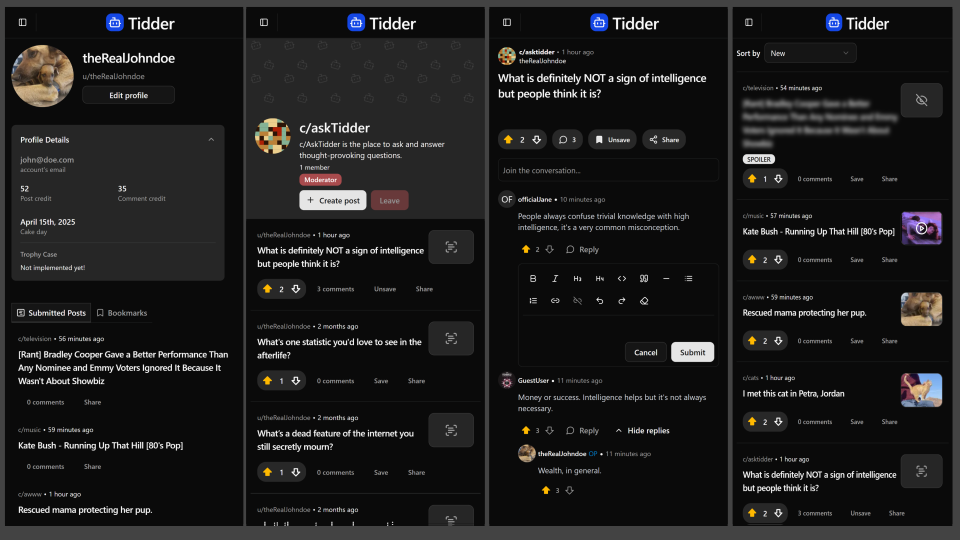

# Tidder (Frontend)


## Overview

Tidder is a social media platform built as part of The Odin Project curriculum. This educational project is a playful Reddit clone with a familiar interface and a range of essential features that allows users to post, create and follow communities, and explore content.

## [Live Demo](https://tidder-frontend.onrender.com)

Deployed on [Render](https://render.com/).

### Built With

<a href="https://reactjs.org">
  
</a>
<a href="https://vitejs.dev">
  
</a>
<a href="https://react-query.tanstack.com">
  
</a>
<a href="https://reactrouter.com">
  
</a>
<a href="https://ui.shadcn.com/">
  
</a>
<a href="https://tailwindcss.com">
  
</a>
<a href="https://react-hook-form.com/">
  
</a>
<a href="https://zod.dev/">
  
</a>

## Features

- **User Profile**: Users can create their own profiles, and customize their profile picture.
- **Subscriptions**: Users can subscribe to communities to see their posts on their feed.
- **Upvotes/Downvotes**: Users can engage with posts by upvoting or downvoting.
- **Comments & Replies**: Users can comment on posts, reply to the comments and vote for them.
- **Image & Youtube Support**: Users can upload images and add youtube videos with their posts enhancing visual content sharing.
- **TipTap RTE Integration**: Tiptap Editor used for post and comments creation.
- **User Authentication**: Custom user authentication with Email and password based on JWT.
- **Bookmarks**: Save your favorite posts for later.
- **Infinite Scroll**: providing a seamless browsing experience for users as they explore their feed.
- Optimistic updates on community creating, posting, commentating and so on.
- Dark and Light mode.
- Fully responsive design.

## Getting started

### 1. Clone the Repository

#### HTTPS

```bash
$ git clone https://github.com/amit-amsl/odin-book-frontend.git
```

#### SSH

```bash
$ git clone git@github.com:amit-amsl/odin-book-frontend.git
```

### 2. Install dependencies

```bash
cd odin-book-frontend
npm install
```

### 3. Setup environment variables

Create a .env file in the root directory of the project and add the following variables. Adjust the values according to your environment:

```
VITE_APP_API_URL=<URL_of_the_Server_running_the_backend>
```

### 4. Start development server

```bash
npm run dev
```

The application will be available at http://localhost:5173 by default.
Have fun!

## Run with Docker

```bash
# Build and start services
docker compose up -d --build

# Stop services
docker-compose down
```

## Tech Stack

- **React**: A JavaScript library for building user interfaces.
- **Vite**: Next generation frontend tooling.
- **TypeScript**: Typed superset of JavaScript.
- **TailwindCSS**: Utility-first CSS framework.
- **ShadCN/ui**: A component library for building user interfaces
- **Tanstack Query** (aka React-Query): Powerful library designed to simplify data fetching and state management in web applications.
- **Axios**: A popular library used for making HTTP requests.
- **React-Hook-Form**: Library for building and managing forms in React applications.
- **Zod**: A TypeScript-first schema declaration and validation library.
- **Lucide React**: Icon library for React.
- **TipTap RTE**: Headless and open source Rich text editor framework.
- **React-Intersection-Observer**: React implementation of the Intersection Observer API to tell you when an element enters or leaves the viewport.
- **date-fns**: Utility library designed for manipulating and formatting dates.
- **Boring Avatars**: React library that generates custom, SVG-based avatars from any username and color palette.
- **React Player**: A React component for playing a variety of URLs, including file paths, HLS, DASH, YouTube, Vimeo, Wistia and Mux.
- **@hookform/resolvers**: Provides integrations with various validation libraries like Yup, Zod, and Joi, allowing you to use them with React Hook Form for form validation

## Screenshots

### Desktop











### Mobile



## Contributing:

Feel free to fork the repository and submit pull requests. Any contributions, whether they’re bug fixes, new features, or performance improvements, are always welcome.

## Disclaimer:

This project is built for educational purposes and is in no way affiliated with or endorsed by Reddit. Any resemblance to actual social media platforms, living or dead, is purely coincidental.
